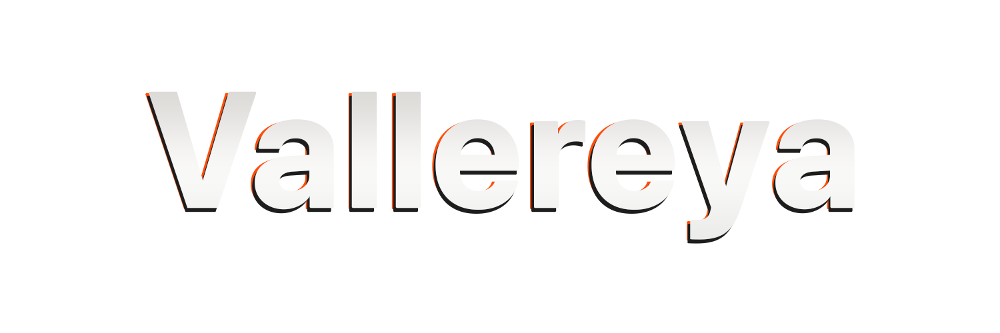

     </img>

<table align="center">
    <tr align="center">
        <td align="center">
             </img>
        </td>
        <td align="center">
             </img>
        </td>
</table>

## 
 💡 About Me

I'm originally a self-taught developer, starting when I was 13 and with Java. Now, with traditional training in Computer Science and Engineering from University and earned my stripes in the industry, quite literally too I might add via the Army as a 25N. Coming up on 2 decades of programming! 💪🏼
 

***& For my Open Source Projects:***
 

I love to build things. From software, tools, languages, games, and much more. These are how I share my ideas to the world. A lot of the work I do doesn’t always have a client or a company behind it. It’s exploratory, experimental, and meant to help others from developers, creators, and people. That’s the stuff I care about most. When you contribute, you’re helping me spend more time on the parts that actually matter. It turns *“this would be cool someday”* into *“this is something you can use”.* Any support makes a real difference.
 

Thank you for being part of it. 💜
 

## 
 ⚡ My Technologies *(languages, frameworks & tools)*

                                        </img>  
                                          </img>  
                                                    </img>  
                                                                </img>  
     
                                    </img>  
                                </img>  
                               </img>  
                                 </img>  
     
      </img>  
                            </img>  
          </img>  
               </img>  
                                    </img>  
                                    </img>  
                                            </img>  
                                                         </img>  

## 
 📊 My Stats

<section align="center">
    <picture align="center">
        
    </picture>
    <picture align="center">
        
    </picture>
</section>

###### 
 *NOTE: Top languages is only a metric of the languages my public code consists of and doesn't reflect experience or skill level.*

---

<section align="center">
    <picture align="center">
        
    </picture>
</section>

 

## 
 ⬇️ Check Out My Repositories ⬇️ 

 
